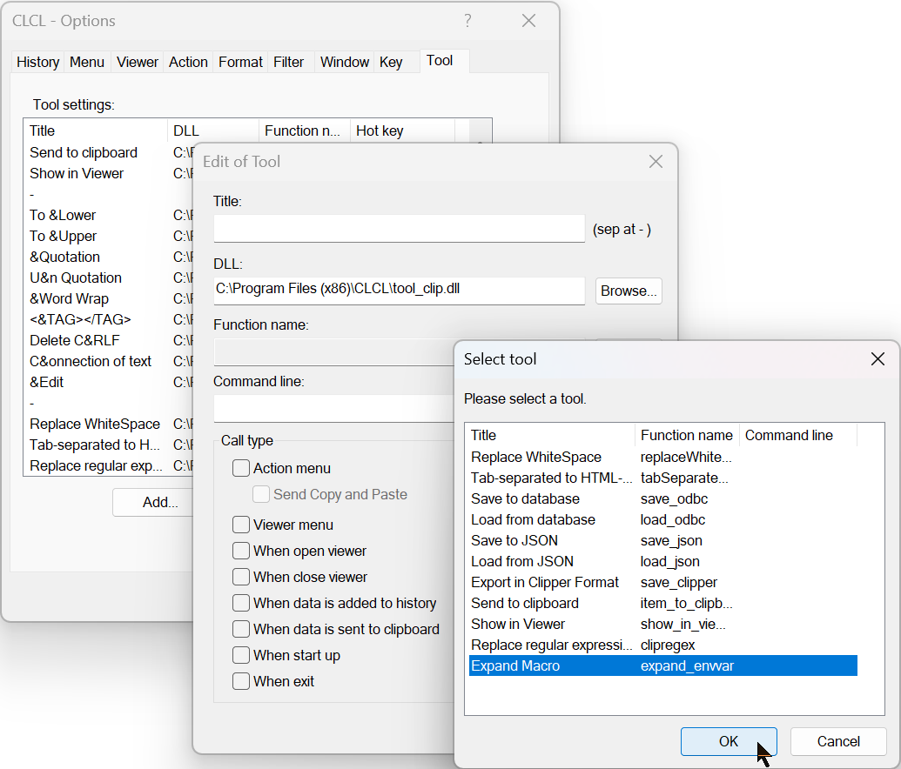
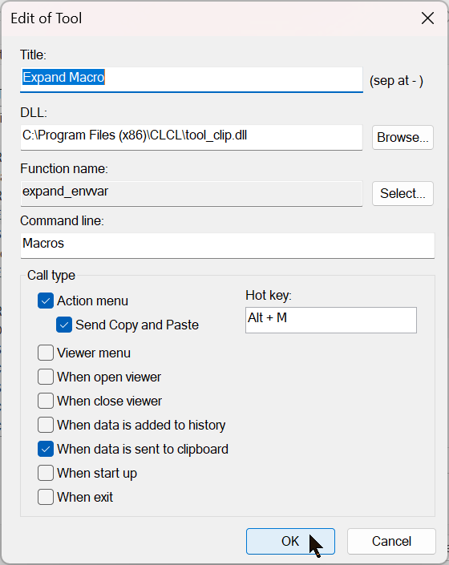
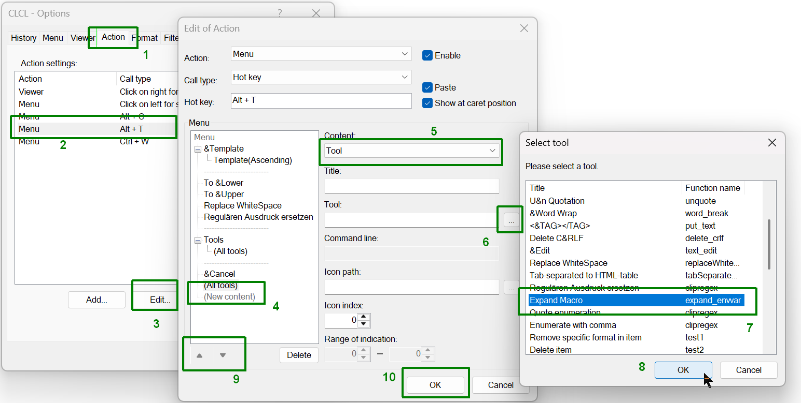
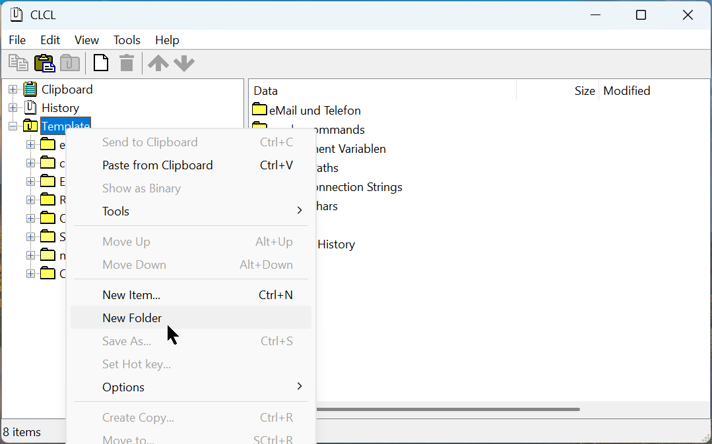
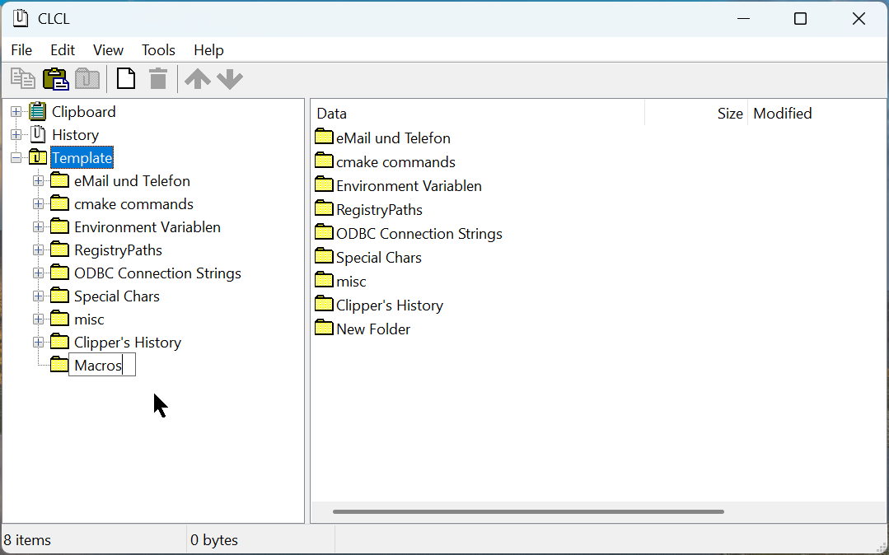
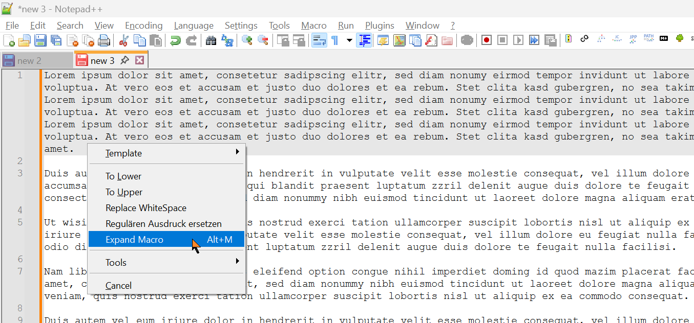
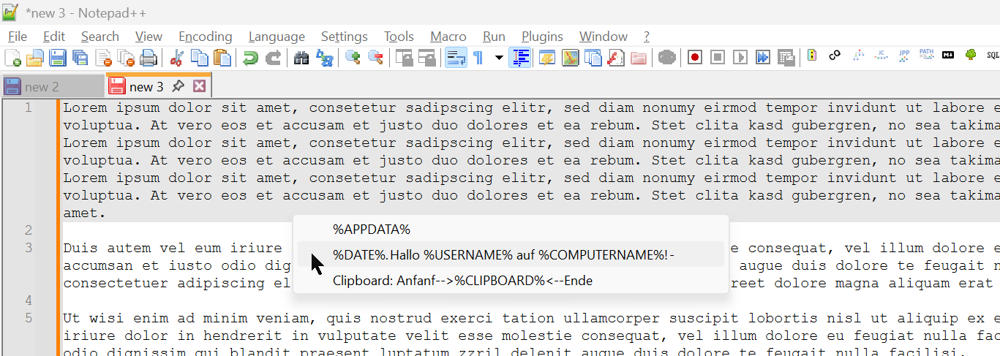
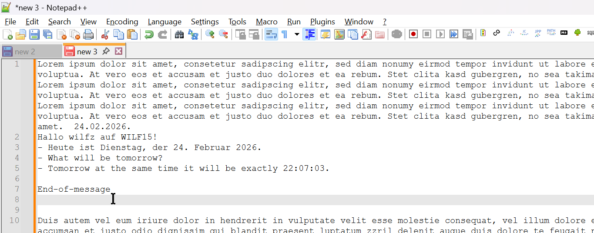

# CLCL-tool_clip

## What is this?
tool_clip is not a standalone program but an extension to Mr. Tomoaki's great CLCL clipboard tool (newest release and sourcecode: https://github.com/wilfz/CLCL).
Currently it contains the following features for clipboard items:
- export items and template folders to json file
- import text items and folders from json file and merge them into template folders
- export to and import from android app "Clipper"
- replace with regular expressions
- replace tabstops and/or sequences of spaces by a character string of choice
- convert tab separated data into an html table snippet, ready to insert into an email, OneNote, etc.
- macros, insert template with expanded variables
- send menu item to clipboard
- show currently selected item in viewer
- save CLCL templates to and load from an ODBC database 

To be continued ...

## Installation:
- Close any active CLCL instance.
- Copy `tool_clip.dll` (preferably) into the CLCL folder `C:\Program Files (x86)\CLCL` or alternatively install with `setup_too_clip.exe`.

## Features

### Macros
The new feature of macros (insertion of template with expanded environment variables, date, time, etc.) is not as self-explaining as most other features in this plugin and needs some explanation:

#### Configuration:
- Start CLCL and open the options. 
- Go to the `Tools` tab, and click the `Add` button.
- Add the `tool_clip.dll` and select the "Expand Macro" (`expand_envvar`) function  

- In `Command line` add the name of your macro folder e.g. _Macros_.  

- If you want to access your macros easily, you can set a hotkey, e.g. `Alt-M`.
- You can also add the Macro tool to any menu of your choice in the `Action` tab.  

- Open CLCL viewer and select the `Template` node.
- Add a folder in the first tier below the `Template` node with the name from above, e.g. _Macros_.  

It is __essential__, that the folder bears the exact name (case-sensitive) as specified in `command line` of the tool and is located directly in `Templates` and not in any subfolder.  

- Now you are ready to create your macros as items with __Unicode format__ in that folder.
- Text macros can contain any environment variable, enclosed in percent symbols, e.g. `%USERNAME%`, `%COMPUTERNAME%` etc.  

- `%DATE%`, and `%TIME%` will be expanded according to your locale settings, but format can be specified explicitly behind a colon, but within the percent brackets.  
Format must conform to Microsoft's [date specification](https://learn.microsoft.com/en-us/windows/win32/intl/day--month--year--and-era-format-pictures) and [time specification](https://learn.microsoft.com/en-us/windows/win32/api/datetimeapi/nf-datetimeapi-gettimeformatex), e.g. `%DATE:dddd, d MMMM, yyyy%` or `%TIME:hh:mm:ss%`

#### Usage:
- While editimg text, invoke the `Tools` popup menu, and choose `Expand Macro`.  

A new popup menu will appear that contains the items of your _Macros_ folder.  

- Choose a macro, and it will immediately be expanded and inserted at your current text cursor position.  

- If you configured a hotkey, e.g. `Alt-M` you can use that as a shortcut to the _Macros_ popup menu.
- If your macro contains `%CLIPBOARD%` this will be expanded to the content of your clipboard prior to invocation of the popup menu. But attention: Even if you cancel the action without choosing from the popup, your clipboard content will be altered!

## Update history
- Ver 1.0.2.0 -> 
	- Features:
		- Macros, expansion of variables in templates
		- preserve regex expression from the previous call
- Ver 1.0.1.0 -> Ver 1.0.2.0
    - Features:
	    - new function "Show in Viewer"
	- Bugfix:
	    - show MessageBox on error in Replace with regular expression
- Ver 1.0.0.4 -> Ver 1.0.1.0
	- Features:
		- replace with regular expressions
		- export to and import from android app "Clipper"
	- Bugfix: 
		- export only TEXT and UNICODE_TEXT items to json file
		- in json-import replace empty title with (beginning of) text content
